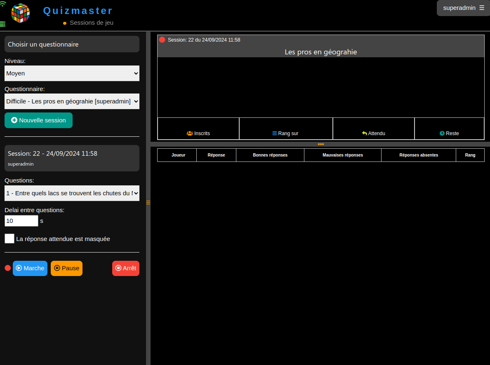

# QuizMaster (SeriousGame)
QuizMaster is a SeriousGame of questions / answers

Here is presented only the master part and players on nano pc (raspberry pi) and mobiles 
Originally it was designed to work with an IOT hardware that will be easy to add:

- an ESP8266 d1-mini processor
- a 0.96" monochrome OLED screen
- 6 to 8 control buttons
- 1 9000 mAh battery and charger

### Description
QuizMaster is a SeriousGame or a questionnaire to test the knowledge of a group of users. 
The master has a control console to send the questions and receives the answers in real time. 
The players have connected hardware (IOT), a mobile, a laptop or any other PC. 
QuizMaster is an application written entirely in python django under MIT license. 
The maintenance and updating of questions is done exclusively from the django administration. 

### REQUIRED
Materials:
- Players: 
Mobiles or laptops, PCs.

- Master: 
PC (Raspberry pi 3, 4, 5) with access point if necessary. 
Mosquitto server

### INSTALLATION
Configuration examples in etc/conf. 
Servers can be installed in the local or public network (ssl). A local installation is preferred 
Refer to the quizmaster/help.install.txt file which details the procedures.

- Download the code [here](https://github.com/deunix-educ/QuizMaster) 

        tar xzfv QuizMaster-main.zip 
        or 
        git clone git@github.com:deunix-educ/QuizMaster.git 
        cd quizmaster chmod +x etc/bin/*.sh 
        chmod +x quizmaster/*.py 

- Install system packages first 

        sudo apt -y install build-essential openssl git pkg-config binutils supervisor mo squitto sqlite3 
        sudo cp /etc/supervisor/supervisord.conf /etc/supervisor/supervisord.conf.old 
        sudo cat >> /etc/supervisor/supervisord.conf << EOF [inet_http_server] port=*:9001 username=root password=toor EOF 

- configure servers 

    mosquitto: adapter etc/conf/mosquitto-local.conf

        sudo cp etc/conf//mosquitto-local.conf /etc/mosquitto/conf.d/

    quizmaster: Adapt etc/conf/quiz-service.conf
        sudo cp etc/conf/quiz-service.conf /etc/supervisor/conf.d/
        sudo supervisorctl reread

    Edit and Configure Environment Variables quizmaster/.env-example
        Configure users and passwords correctly (superadmin, quizmaster, quizbox)
        cp quizmaster/.env-example quizmaster/.env

    Create the python environment (.venv)
        etc/bin/venv-install.sh etc/install/requirements.txt
        cd quizmaster
        ./manage.py makemigrations
        ./manage.py migrate
        ./manage.py initapp
        ./manage.py loaddata ../etc/install/quizmaster.json

### Usage
Access http://ip.quizmaster/ with a login/password

- Quizmaster machine: 
    Start the mqttcd and quizmaster services (supervisor http://127.0.0.1:9001)

        Admin access: superadmin
        Master access: quizmaster

- Player machines: 
    Connect to the network, or better to the access point of the quizmaster machine

        Game access: quizbox
    